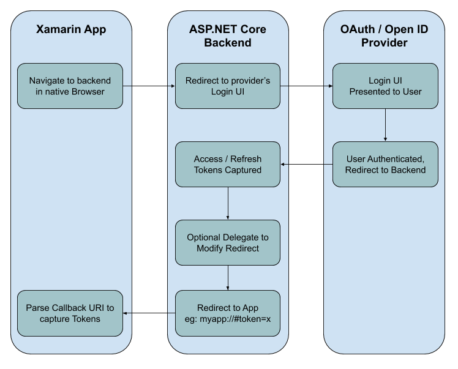

# Xamarin.AspNetCore.Authentication
Sample for how to use AspNetCore Authentication providers with Xamarin mobile apps


## The Challenge

Adding authentication providers to your Xamarin Mobile apps can be challenging.  There are many different approaches, some of which are no longer considered appropriate due to security concerns (you should never embed a client secret in your Mobile app), and some of which require native SDK's with no common set of API's to implement from a Xamarin cross platform app.

The goal is to provide a cross platform API to authenticate with a variety of providers in a Xamarin mobile app, with minimal dependencies in a secure implementation.

## The Solution

ASP.NET Core provides an easy to setup and use implementation of OAuth and OpenID Connect authentication with a variety of providers supported by Microsoft, and even more supported by the ASP.NET Contrib repository.  Leveraging this work makes sense from an engineering and support efficiency perspective, as well as from a security perspective.

Using ASP.NET Core's authentication model, the server backend can handle all of the authentication implementation, and the front end Xamarin mobile app only needs to know how to initiate the process and listen for a callback.

The flow using this solution looks something like this:




The concept is to provide two NuGet packages:
 - Xamarin.AspNetCore.Auth - containing the ASP.NET Middleware to help with the mobile authentication flow initiation and app URI redirect callback logic
 - Xamarin.AspNetCore.Auth.Mobile - the client side Xamarin App implementation of calling out to the platform specific browser controls and waiting for and parsing the callback from the backend


## Using the NuGet's in your Backend and Xamarin App

### ASP.NET Backend Configuration

You would install the `Xamarin.AspNetCore.Auth` NuGet package in your ASP.NET Core backend project.

In your `ConfigureServices` method in the `Startup.cs` file, you need to call `UseXamarinAuth` before you call `AddAuthentication`:

```csharp
services.AddXamarinAuth(o =>
    {
        o.CallbackUri = new Uri("myapp://");
    });
```

Notice that you must specify your app's callback URI Schema in the configuration options so the middleware knows where to redirect to.

After this code you can call `AddAuthentication` as you normally would in your app, adding any providers you wish to use.  For example:

```csharp
services.AddAuthentication()
    .AddCookie()
    .AddFacebook(fb =>
    {
        fb.AppId = "123456789";
        fb.AppSecret = "xxxxxxxxxxx";
        fb.SaveTokens = true;
    });
```

> IMPORTANT: Notice the `SaveTokens = true` which is required to be set for any providers you wish to use with the Xamarin app and the Xamarin middleware.

In your `Startup.cs`'s `Configure` method, you need to call `app.UseXamarinAuth();` before `app.UseRouting()` and before `app.UseAuthentication()`.


### Xamarin App Configuration

After installing the `Xamarin.AspNetCore.Auth.Mobile` NuGet package, you will need to setup your platform specific initializations:

#### iOS

In your `AppDelegate.cs` you should add the following method:

```csharp
public override bool OpenUrl(UIApplication app, NSUrl url, NSDictionary options)
{
    if (Xamarin.AspNetCore.Auth.Mobile.Platform.OpenUrl(app, url, options))
        return true;

    return base.OpenUrl(app, url, options);
}
```

You will also need to ensure your `Info.plist` contains a registration of your app's callback schema.  For `myapp://` it would look like:

```xml
<key>CFBundleURLTypes</key>
<array>
    <dict>
        <key>CFBundleURLSchemes</key>
        <array>
            <string>myapp</string>
        </array>
    </dict>
</array>
```

#### Android

In your `MainActivity`'s `OnCreate`  you need to initialize the library with this call:

```csharp
Xamarin.AspNetCore.Auth.Mobile.Platform.Init(this.Application);
```

You will also need to add a call to your `MainActivity`'s `OnResume` like this:

```csharp
protected override void OnResume()
{
    base.OnResume();

    Xamarin.AspNetCore.Auth.Mobile.Platform.OnResume(Intent);
}
```

Finally, you need to subclass `AuthCallbackActivity` with the appropriate attributes (notice the `DataScheme` value of `myapp` here to handle `myapp://` schema callbacks):

```csharp
[Activity(NoHistory = true, LaunchMode = LaunchMode.SingleTop)]
[IntentFilter(new[] { Intent.ActionView }, Categories = new[] { Intent.CategoryDefault, Intent.CategoryBrowsable }, 
    DataScheme = "myapp")]
public class AuthCallbackActivity : Xamarin.AspNetCore.Auth.Mobile.AuthCallbackActivity
{
}
```


### Authenticating from your Xamarin App

With everything configured you need to only know a few key pieces of information to begin authenticating from your Xamarin App's shared code:

 - ASP.NET Backend Base URL (eg: `https://myapp.com/`)
 - Your App's Redirect Scheme (eg: `myapp://`)
 - The Provider name you wish to authenticate with

Here is an example of authenticating with this information:

```csharp
var r = await Authentication.AuthenticateAsync(new Uri("myapp://"), new Uri("https://myapp.com"), "GitHub");
```

The provider name correlates to the authentication scheme name for the providers you added.  The default is typically obvious (eg: `"GitHub"`, or `"Facebook"`, or `"Google"`) but if you change the name in your options you will have to use the correct name here.


### Customization

There are some assumed conventions with the configuration above.  First of all, this assumes you are ok with the Xamarin middleware capturing the default route of `/mobileauth` on your backend project.  You can change this by setting the `AuthPath` in the `XamarinAuthOptions` when calling `services.UseXamarinAuth(o => o.AuthPath = "/custompath");`.  You would also need change your Xamarin App's `AuthenticateAsync` call to specify the `authenticationPath: "/custompath"` parameter to match.

By default the app callback will include a URI fragment containing tokens and expiration epoch time (if available) like the following:

```
#access_token=xyz&refresh_token=zyx&expires_in=3600
```

If you want to send something different back to the app (for instance, you might want to generate your own JWT on the backend from the access token and send that back to the client instead), you can set the `AuthenticatedRedirectHandler` delegate on the `XamarinAuthOptions` when configuring your services:

```csharp
services.UseXamarinAuth(o => {
    o.AuthenticatedRedirectHandler = (HttpContext httpContext, AuthenticateResult authResult, IDictionary<string, string> callbackParams) => {

        var customAccessToken = GenerateCustomAccessToken(callbackParams);

        // Don't send back any of the provider's tokens or expiration
        callbackParams.Clear();

        // Add our custom token to the parameters to callback with to the app
        callbackParams.Add("access_token", customAccessToken);
        callbackParams.Add("expires_in", DateTime.UtcNow.AddDays(1).ToUnixTimeSeconds());
    };
});
```